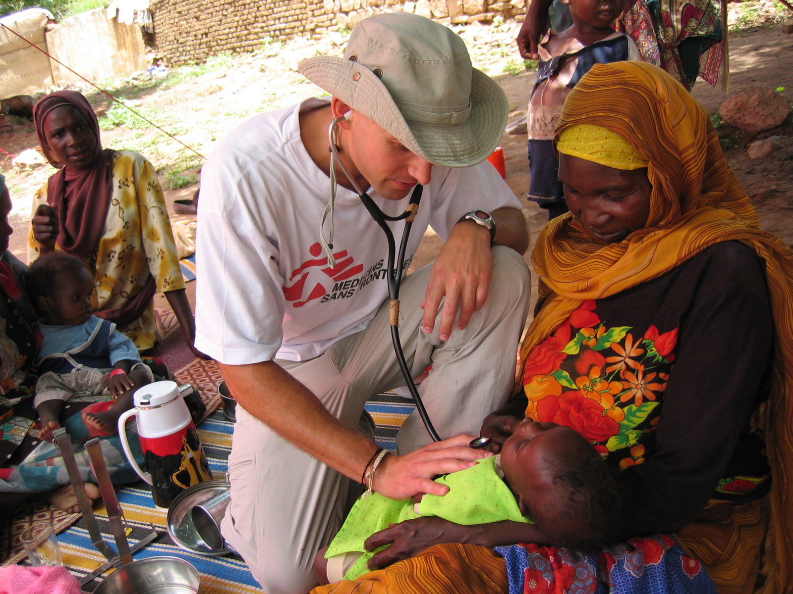
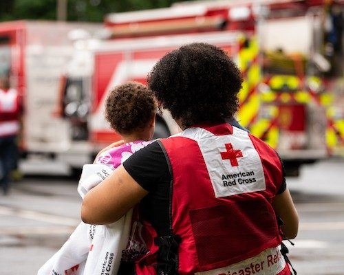

**Welcome to my GitHub page!**

**Email:** glase011@ccsusm.edu

**Phone Number:** (760) 310-2461

# About me

I am an M.S. Supply Chain Analytics graduate student at California State University - San Marcos with a background in Anthropology. I am team-oriented and I have technical experience that includes coursework in computer science, statistics, and data analysis. I am experienced in technical writing, inventory tracking, data entry, and programming (Java, Python, C++), with an interest in applying analytical methods to operational and supply chain challenges.

```js
public class HelloWorld {
  public static void main(String args[]) {
    system.out.print("Hello, World!");
  }
}
```
My first ever line of code!

# Personal Goals

I am pursuing a Master of Science in Supply Chain Analytics to develop advanced skills in systems analysis and optimization. My academic and professional goals reflect a focus on analyzing and interpreting data, whether in computer systems and software or the study of human populations. I aspire to combine both my undergraduate education in anthropology with supply chain analytics to work in humanitarian logistics, where effective resource and aid allocation depends on both technical skills and knowledge of local social structures. This degree is a step toward applying supply chain analytics to complex operational challenges with meaningful social impact.

> _“When given the chance to turn away or do good, always err on the side of reckless compassion.”_ — fandomsandfeminism, writing on the _RMS Carpathia_ racing to rescue the _Titanic_

## Humanitarian Logistics


_"Humanitarian logistics is the process of planning, implementing, monitoring, and controlling the acquisition, storage, and transportation of goods and materials from the point of origin to disaster sites. Its purpose is to manage inventory, facilitate communication, support infrastructure, and deliver resources to help alleviate the suffering of disaster-affected populations efficiently and cost-effectively."_ -ascend.ahacentre.org

 

Humanitarian organizations prefer people with experience in the supply chain industry. I am hoping to gain some experience with a local company, then eventually get a job in supply logistics for a humanitarian organization like Red Cross or Doctors without Borders. 

## Education and Professional Experience

### Education
* A.A. Liberal Arts: Emphasis in Math and Science from MiraCosta College

* B.A. Biological Anthropology from CSUSM

* plus 3+ years of programming experience from both CSUSM and MCC

### Professional Experience

**Laboratory Data Consultants, Carlsbad, CA — Technical Writer**

JULY 2021 – APRIL 2022

* Analyzed and synthesized environmental laboratory data to produce technical reports for regulatory and client use
* Collaborated with chemists and project managers to interpret analytical results and ensure data accuracy
* Performed structured data entry, validation, and documentation in compliance with reporting standards
* Organized and maintained technical records to support efficient data retrieval and project workflows

**Vista Haircuts, Vista, CA — Front Desk Receptionist**

JUNE 2015 – JULY 2021

* Managed point-of-sale transactions and cash reconciliation in a high-volume customer environment
* Tracked inventory levels of products and supplies, supporting restocking and purchasing decisions
* Monitored product usage patterns to prevent shortages and overstocking
* Scheduled appointments and maintained operational efficiency during peak business hours
* Delivered consistent customer service while supporting day-to-day business operations

#### Skills

##### Technical 
* Programming: Java, Python, C++
* Data Analysis & Entry
* Research Design (Qualitative & Quantitative)
* Microsoft 365

##### Professional 
* Written and verbal communication
* Technical and analytical writing
* Inventory tracking and organization 
* Collaboration and team building


#### Awards

1. President's List award for academic achievement, Fall 2020 
2. Certificate of Achievement in IGETC with Honors, May 2021
3. Dean’s List award for academic achievement Spring 2025
4. Dean’s List award for academic achievement Fall 2025
5. Dean’s List award for academic achievement Spring 2026


### Fun Facts:

<dl>
<dt>Birthplace:</dt>
<dd>San Diego</dd>
<dt>Favorite Color:</dt>
<dd>Pink</dd>
<dt>Favorite Book:</dt>
<dd>Annihiliation by Jeff VanderMeer</dd>
<dt>Favorite Animal:</dt>
<dd>Orangutans</dd>
</dl>

